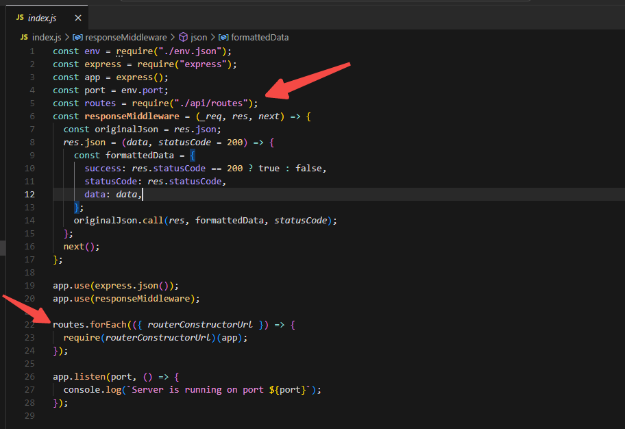

# 通过 Node 命令生产 Restful 风格的 Api

## 快速体验

当前文档较为冗长，有兴趣的老哥可以直接clone以下链接
[当前dome的gitee地址(完整版)](https://gitee.com/ljj6666666666666/rest-mocker)
进入到项目目录，按顺序执行以下命令
```bash
npm i
npm run start
npm run genApi
```
然后根据终端的输出
复制打开到postman即可体验

## 前情提要

以前在外企工作时，因为测试数据的创建需要调动不少的资源，因此老板一直希望有一个 mockServer, 用于为开发阶段让前端和后端并行开发, 也用于为自动化测试环境提供模拟的测试接口

因此，给予了我这么一个小需求，让我搭建一个简易版的 mockServer，可以支持开发快速 mock 一些 Restful 风格的 Api

我心想 mockServer 的话，用 express 不是随便写吗

但作为团队服务的支持者，我还是想把这个工作做的更便利些

于是便有了这个"基于 Node 命令快速生成 Restful 风格的 Api"的想法

其实关于这个"基于 Node 命令快速生成 Restful 风格的 Api"的实现

灵感是来自 nest.js 和 angular2 的脚手架

我相信只要是用过以上两个框架的同学，都对一个功能印象深刻，那就是根据命令快速生成样板代码

例子如下


所以我对我自己的这个 mockServer 的要求也如上

- 通过命令行，询问用户 controller 的名称
- 用户不需要理解任何细节，回答完 controller 的名称，生成完毕之后，即可马上调用对应的 mock 接口

话不多说，直接开工

## 具体实现

### 步骤一：获取用户输入

询问用户需要创建的 controller 的名称

其实本质上就是在终端中开启一个对话，这里我们用一个现成的 npm 包 ——— `inquirer`去实现

简单用法如下

```js
const inquirer = require("inquirer");

inquirer
  .prompt([
    {
      type: "input",
      name: "apiKey",
      message: "Enter the apiKey name:",
      default: "dome",
    },
    {
      type: "input",
      name: "idKeyName",
      message: "Enter the idKeyName name:",
      default: "id",
    },
  ])
  .then((an) => {
    console.log(an);
  });
```

我们使用 node 命令执行这个脚本之后，就会出现如下对话

输入完毕后，我们就可以在上述的 than 回调里获取到用户输入的内容，如下图所示


### 步骤二：准备模板

既然要生成代码，我们就需要对应的模板，这里我用到的是传统的`ejs`模板
所谓的模板，也不是什么高大上的玩意
传统后端开发，如 jsp，asp，php 在做服务端 web 开发的时候天天都在写
甚至我当年用 node 和`ejs`做网页开发的时候也写过不少，只不过输出的都是 HTML 文件
这次我们不妨思维开放一定，反正都是要生成，为什么不可以直接生成 node.js 脚本呢
篇幅有限，直接上模板

`这个文件夹存放了两个文件，一个是模板，一个是JSON`
`ps: 理解该模板需要你有一点点express基础，但具体内容，就是定义了增删查改这四个接口，并以一个对应的json文件，作为数据源`

```js
// ejs模板
const fs = require("fs");
const path = require("path");
const JsonPath = "./data.json";
const writeJson = (data) =>
  fs.writeFileSync(
    path.join(__dirname, "data.json"),
    JSON.stringify(data, null, 2)
  );

module.exports = (app) => {
  // 获取所有数据
  app.get("/<%= apiKey %>", (_req, res) => {
    res.status(200).json(require(JsonPath));
  });

  // 获取特定数据
  app.get("/<%= apiKey %>/:id", (req, res) => {
    const dataMap = require(JsonPath);
    const dataId = parseInt(req.params.id);
    const data = dataMap.find((u) => u.<%= idKeyName %> === dataId);
    if (data) {
      res.json(data);
    } else {
      res.status(404).json({ message: "Data not found" });
    }
  });

  // 创建数据
  app.post("/<%= apiKey %>", (req, res) => {
    const dataMap = require(JsonPath);
    const newData = {
      id: dataMap.length + 1,
      ...req.body,
    };
    dataMap.push(newData);
    writeJson(dataMap);
    res.status(200).json(newData);
  });

  // 更新数据
  app.put("/<%= apiKey %>/:id", (req, res) => {
    const dataMap = require(JsonPath);
    const dataId = parseInt(req.params.id);
    const dataIndex = dataMap.findIndex((u) => u.<%= idKeyName %> === dataId);
    let data = dataMap.find((u) => u.<%= idKeyName %> === dataId);
    if (data) {
      const newData = {
        ...data,
        ...req.body,
      };
      dataMap[dataIndex] = newData;
      writeJson(dataMap);
      res.json(newData);
    } else {
      res.status(404).json({ message: "Data not found" });
    }
  });

  // 删除数据
  app.delete("/<%= apiKey %>/:id", (req, res) => {
    const dataMap = require(JsonPath);
    const dataId = parseInt(req.params.id);
    const dataIndex = dataMap.findIndex((u) => u.<%= idKeyName %> === dataId);
    if (dataIndex >= 0) {
      dataMap.splice(dataIndex, 1);
      writeJson(dataMap);
      res.status(200).json({ message: "Deleted success!" });
    } else {
      res.status(404).json({ message: "Data not found" });
    }
  });
};
```

上述模板的`<%= apiKey %>`和`<%= idKeyName %>`就是我们想替换的地方，这些地方届时将注入进用户的输入

### 步骤三：将用户输入和模板结合，并输出出去

对于这一步，我们需要编写一个函数，该函数有三个入参

- 参数一: 存放模板的文件夹的路径
- 参数二: 目标脚本的输出路径
- 参数三: 用户输入

该函数做了以下几件事，

- 读取模板文件夹里的内容，如下
  
- 将读取到的内容，和用户输入的数据耦合
- 耦合完毕后，将文件类型从 ejs 更改为 js，并放在一个新创建的文件夹里面
- 将新文件夹放到`参数二:目标脚本的输出路径`

具体实现如下:

```javascript
// - templatePath: 存放模板的文件夹的路径
// - targetPath: 目标脚本的输出路径
// - data: 用户输入
const processTemplateFolder = (templatePath, targetPath, data) => {
  fs.readdir(templatePath, (err, files) => {
    if (err) throw err;
    files.forEach((file) => {
      const sourceFilePath = path.join(templatePath, file);
      const targetFilePath = path.join(targetPath, file);

      /**
       * 递归
       */
      fs.stat(sourceFilePath, (err, stat) => {
        if (err) {
          throw err;
        }

        if (stat.isDirectory()) {
          /**
           * 创建目标文件夹
           * 为目标文件夹写入数据
           */
          makeDir(targetFilePath).then(() => {
            processTemplateFolder(sourceFilePath, targetFilePath, data);
          });
        } else {
          if (sourceFilePath.endsWith("ejs")) {
            /**
             * 写入用户输入数据并输出为js格式的文件
             */
            ejs.renderFile(sourceFilePath, data, (err, str) => {
              if (err) {
                throw err;
              }
              fs.writeFileSync(
                targetFilePath.replace(".ejs", ".js"),
                str,
                "utf8"
              );
            });
          }

          if (sourceFilePath.endsWith("json")) {
            fs.writeFileSync(targetFilePath, "[]", "utf8");
          }
        }
      });
    });
  });
};
```

### 步骤四 自动注册 controller

好人做到底，controller 创建完毕之后，我们希望将 controller 都一并将它自动注册了

具体怎么实现呢？

- 步骤一: 我们需要用到 nodemon，一个文件 node 版本的文件热更新，任何文件的更新都可以重新 reload 当前的 node 程序
- 步骤二：既然有了文件监听，那么我们只需要准备一个配置文件`如下`，每次创建完一个 controller 之后，将 controller 的信息和目标路径写入配置中
- 步骤四：nodemon 监听配置文件变化，基于最新的配置`如下`注册 controller
  

::: tip
注意!!
在创建 controller 前，需判断是否已存在对应的 controller
上述编写的基于上述编写的 processTemplateFolder 函数，我们已经可以顺利创建 controller
但在调用 processTemplateFolder 函数之前，我们还需要做一下判断，假设目标 controller 已存在，我们则需要给用户一个警告
:::
代码实现如下，我们只需要在上述提到的 then 函数，配合我们刚刚编写完成的 processTemplateFolder 函数，添加上以下代码

```js
inquirer
  .prompt([
    {
      type: "input",
      name: "apiKey",
      message: "Enter the apiKey name:",
      default: "dome",
    },
    {
      type: "input",
      name: "idKeyName",
      message: "Enter the idKeyName name:",
      default: "id",
    },
  ])
  .then((an) => {
    try {
      /**
       * 目标输出路径
       */
      const targetOutputUrl = path.join(process.cwd(), "api/" + an.apiKey);
      /**
       * 目标所在路径
       */
      const templatePathUrl = path.join(
        process.cwd(),
        "genApi/restApiTemplate"
      );

      /**
       * 路由JSON的目标地址
       */
      const routesFilePath = path.join(process.cwd(), "api", "routes.js");

      /**
       * 路由注册，所有的controller都注册在这个json里面
       * 新增的controller也同样需要同步注册到这个json中
       */
      const routes = require(routesFilePath);

      /**
       * 根据用户输入的apiKey，判断是否已经注册了类似的controller
       */
      const isHaveSameController =
        routes.findIndex((i) => i.key === an.apiKey) >= 0;

      /**
       * 如果已经有了同名controller，则发出警告
       */
      if (isHaveSameController) {
        console.log(chalk.red(an.apiKey + " controller already exists"));
      } else {
        /**
         * 否则，则创建一个新的文件夹
         *
         */
        makeDir(targetOutputUrl).then(() => {
          /**
           * 写入controller
           */
          processTemplateFolder(templatePathUrl, targetOutputUrl, an);
          /**
           * 将controller，同步注册到路由配置中
           */
          routes.push({
            key: an.apiKey,
            routerConstructorUrl: `./api/${an.apiKey}/index`,
          });
          fs.writeFileSync(
            routesFilePath,
            `module.exports = ${JSON.stringify(routes, null, 2)};`
          );

          /**打印成功消息 */
          console.log(
            chalk.green(
              `rest api http://localhost:${env.port}/${an.apiKey} have been create`
            )
          );
        });
      }
    } catch (error) {
      console.log(error);
    }
  });
```

最后的最后，注册代码如下，在 app.js 引入配置 json，写个循环即可


## 功能展示

让我们创建一个名为 Test 的 RestfulApi

然后在 postMan 上体验一下

- 先用 post 创建一条数据
  
- 再用 Get 去获取所有的数据
  
- 再用 put 去修改刚刚创建的数据
  
  - 验证一下
    
- 再用 delete 去删除刚刚创建的数据
  
  - 验证一下
    

一切顺利，为团队服务的 mockServer 就此诞生~~

## 让我们拓展思维

其实回顾我们前端的大部分业务场景，特别是 ToB 的业务，是否存在在很多重复且量大的工作呢，是否会发现存在很多大部分相似，而只有一小部分不相同的场景呢
因此我想，以上的套路也适合应用到其他场景
毕竟，node 能生成的东西永不止 JavaScript 脚本这么简单
而 mockServer 也绝对可以连接到正式的数据库，从而做更多的事情
所以请 open your mind

## 相关资源

[当前dome的gitee地址](https://gitee.com/ljj6666666666666/rest-mocker) 有需要的欢迎拷贝
[inquirer文档](https://www.npmjs.com/package//inquirer)
[express文档](https://www.npmjs.com/package/express)
[express文档](https://www.npmjs.com/package/nodemon)